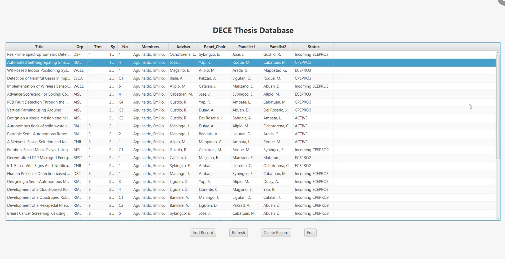

# 🎓 Java-based ECE/CpE Thesis Management System with JavaFX GUI

A **JavaFX-based desktop application** that helps manage and organize thesis projects for Electronics and Computer Engineering (ECE/CpE) students. Designed with object-oriented programming principles, this system provides a user-friendly interface and modular architecture for administrators and students.

---

## 📌 Features

- 🔐 **User Authentication** (Admin and Student roles)
- 🗃️ **Thesis Record Management** with CRUD operations
- 🧠 **Object-Oriented Programming Concepts**
  - Encapsulation
  - Inheritance
  - Polymorphism
  - Abstraction
- 📊 Basic data display and GUI interaction
- 🔍 Extendable for features like:
  - Keyword search
  - Progress charts
  - Cloud storage
  - Secure data access

---

## 🖼️ Screenshots

> 📂 Save all images in a `screenshots/` folder and link them like shown below.

### 🔐 Login Prompt
  
*A simple login screen prompting the user for credentials.*

---

### 🛠️ Admin Dashboard
  
*Admin view for adding/editing student and thesis records.*

---

## 🧑‍💻 Programs Used

- Java 11+
- JavaFX
- SceneBuilder (for GUI layout)
- MVC pattern
- IDE: IntelliJ

